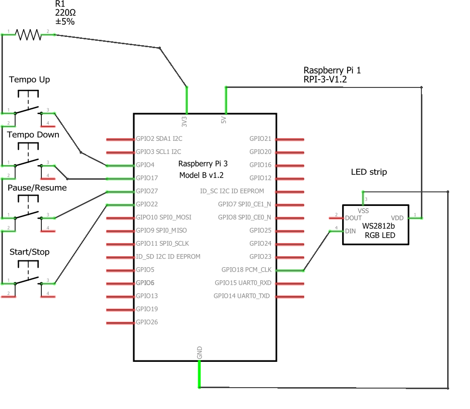
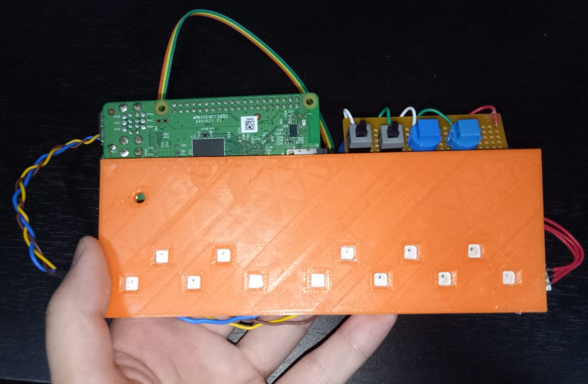
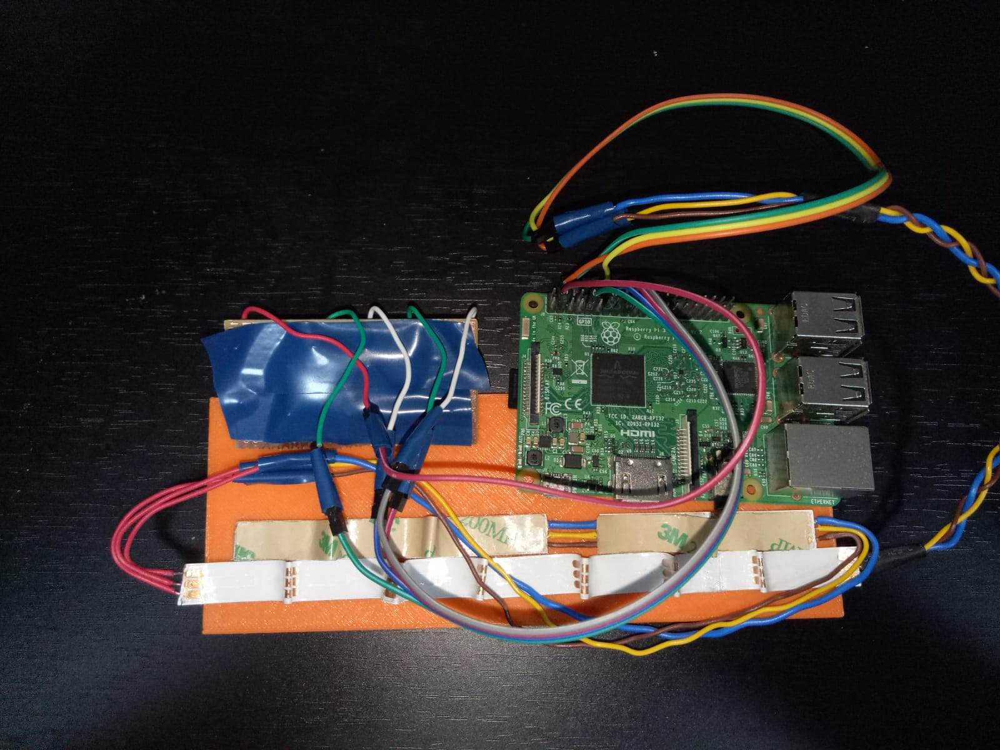
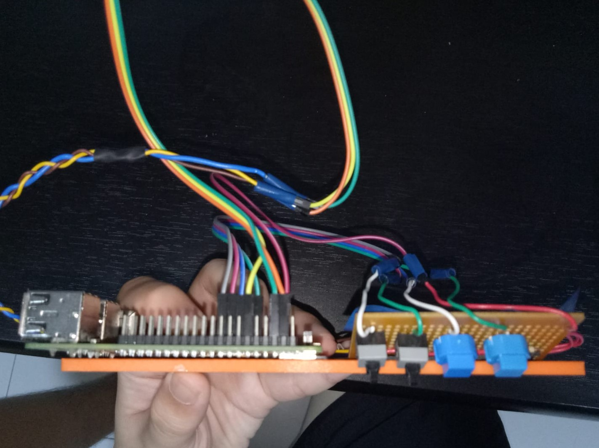

# Piano_learner
A simple python program that takes in a midi file and lights up corresponding a WS2812b Led strip\
# Replicating Circuit Board
To replicate the Pianolearner, the following components are required

1. 4x momentary switch (Any type)
2. Resistor (220 ohms)
3. Raspberry Pi 3 model B
4. Custom 3d printed bracket for Led strip
5. WS2812b LED strip
6. 8x female to female jumper wires
7. Mounting Tape

The Schematic is as below

Hook up the connection as per schematic, the physical assembly can be up to personal preference but in this scenario the Raspberry pi and the buttons would be attached on the bracket using mounting tape. Refer to pictures if in doubt.

# The Code
The main python program is called "rpi_main.py" you can run it for a test, or run the setup script called "setup.sh" as root which would install all the necessary dependencies and run the python program on system start-up.\
\
do take note that to change "pi" in both pianoscript.sh and setup.sh if that is not your username
# Pictures

